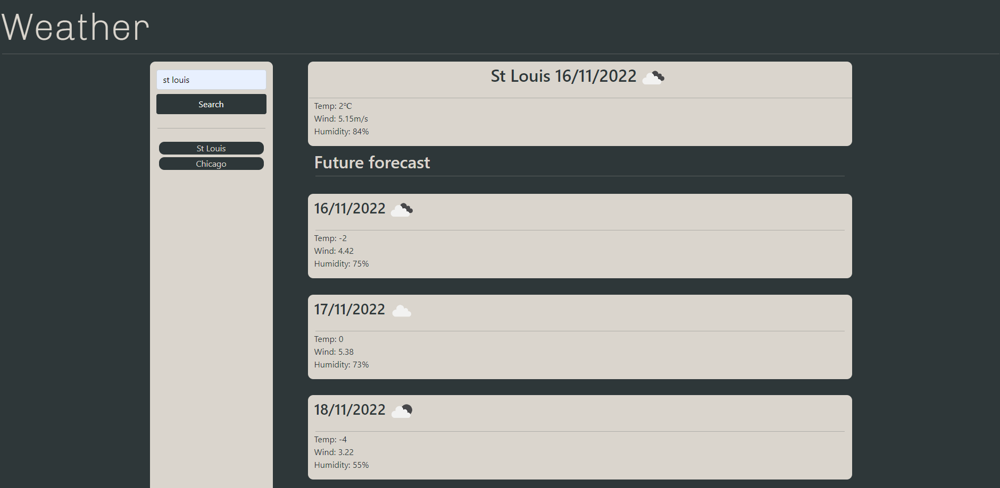

# Weather Search

## Description

This program will allow a user to look up the weather for a specific city. Entering the name of the city in the search bar will display the city name, current date, temperature, wind speed, humidity and an icon of the current weather. It will also display the following 5 days weather condition for the given city. Cites typed in the search bar are saved and displayed bellow. clicking on any of the cities in the history will display the city's weather.
## Installation

link to the cite: https://nhatwin.github.io/hw-6/

## Usage

This program can be used to determine the weather for a given day or subsequent days. A user can use this program to get information about the weather for there location or other cities.
## Screenshot

## Credits

N/A

## License

Please refer to the LICENSE in the repo.